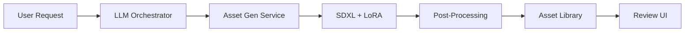
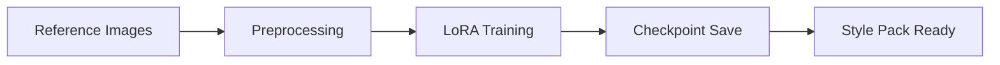
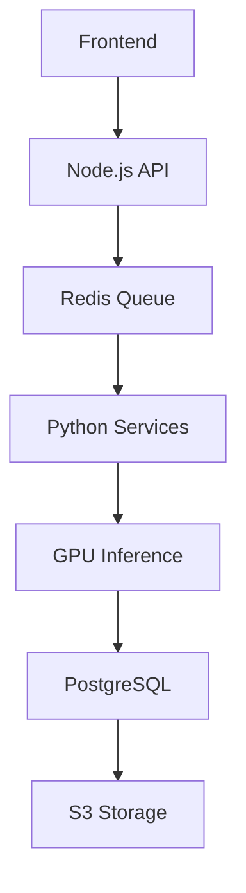

# GameForge AI Asset Creation System - Implementation Roadmap

## 🚀 **CURRENT STATUS ANALYSIS**

### ✅ **COMPLETED INFRASTRUCTURE (Phase 1)**
1. **Frontend Workspace**: Tab-based navigation (Assets, Style Packs, Batch Requests, AI Generator)
2. **StylePackManager.tsx**: Complete training interface with progress monitoring
3. **BatchRequestCreator.tsx**: Natural language batch asset generation
4. **Backend Services**: LLM Orchestrator, WebSocket, Job Queue, Vector Memory
5. **Database**: PostgreSQL with Prisma ORM
6. **Redis**: Job queue management (5.0.14.1)
7. **Authentication**: JWT + OAuth ready

---

## 🎯 **PRODUCTION PIPELINE IMPLEMENTATION ROADMAP**

Following the blueprint architecture for Scenario AI + HeyBoss AI workflows:

### **PHASE 2: Asset Generation Service (Python/FastAPI) - HIGH PRIORITY**
**Status**: ⚠️ MISSING - Critical component needed

#### Required Implementation:
```python
# backend/asset-gen-service/main.py
from fastapi import FastAPI, BackgroundTasks
from diffusers import StableDiffusionXLPipeline
import torch
from redis import Redis
from sqlalchemy import create_engine

app = FastAPI()

class AssetGenService:
    def __init__(self):
        self.sdxl_pipeline = StableDiffusionXLPipeline.from_pretrained(
            "stabilityai/stable-diffusion-xl-base-1.0",
            torch_dtype=torch.float16
        )
        self.redis = Redis()
        
    async def generate_asset(self, request: AssetRequest):
        # SDXL inference with LoRA
        # Sprite post-processing (alpha, trim, tiling)
        # Store to Asset Library
```

#### Implementation Steps:
1. **Create Python FastAPI service** (estimated: 3-4 days)
2. **Integrate SDXL pipeline** with GPU acceleration
3. **Add LoRA/DreamBooth support** for style consistency
4. **Implement sprite post-processing** (alpha extraction, trimming, tiling)
5. **Connect to job queue** for async processing
6. **Add progress tracking** via WebSocket

---

### **PHASE 3: Trainer Service (Python) - HIGH PRIORITY**
**Status**: ⚠️ MISSING - Required for Style Pack functionality

#### Required Implementation:
```python
# backend/trainer-service/trainer.py
from diffusers import StableDiffusionXLPipeline
from peft import LoraConfig, get_peft_model
import torch

class StylePackTrainer:
    def train_lora(self, style_pack_id: str, reference_images: List[str]):
        # Load SDXL base model
        # Create LoRA configuration
        # Train on reference images
        # Save checkpoint to S3/storage
        # Update progress via WebSocket
```

#### Implementation Steps:
1. **Create Python training service** (estimated: 4-5 days)
2. **Implement LoRA training pipeline** with SDXL
3. **Add dataset preprocessing** for reference images
4. **Connect to job queue** for async training
5. **Add progress monitoring** and checkpointing
6. **Integrate with Style Pack storage**

---

### **PHASE 4: Review & Approve System - MEDIUM PRIORITY**
**Status**: 🔄 PARTIALLY READY - Frontend components needed

#### Required Components:
```tsx
// src/components/AssetReviewPanel.tsx
export const AssetReviewPanel = () => {
  return (
    <div className="review-workspace">
      {/* Side-by-side variant comparison */}
      {/* 1-click approve/reject buttons */}
      {/* Batch operations interface */}
      {/* Regeneration controls */}
      {/* Upscaling options */}
    </div>
  )
}
```

#### Implementation Steps:
1. **Create AssetReviewPanel component** (estimated: 2-3 days)
2. **Add variant comparison interface** with zoom/pan
3. **Implement batch approval workflow**
4. **Add regeneration triggers** to job queue
5. **Create upscaling pipeline** integration
6. **Add feedback loop** to Style Pack learning

---

### **PHASE 5: HeyBoss-Style AI Assistant - MEDIUM PRIORITY**
**Status**: 🔄 PARTIALLY READY - Backend tools API needed

#### Required Implementation:
```tsx
// src/components/AIAssistantPanel.tsx
export const AIAssistantPanel = () => {
  return (
    <div className="ai-assistant">
      {/* Chat interface */}
      {/* Inline asset previews */}
      {/* Tool calling interface */}
      {/* Context-aware suggestions */}
    </div>
  )
}
```

#### Backend Tools API:
```typescript
// backend/src/services/toolsAPI.ts
export class ToolsAPI {
  async generateAsset(prompt: string): Promise<Asset[]>
  async createStylePack(references: File[]): Promise<StylePack>
  async scaffoldCode(requirements: string): Promise<CodeSuggestion>
  async queryDesignDocs(query: string): Promise<DesignDoc[]>
}
```

---

### **PHASE 6: Asset Library Enhancement - LOW PRIORITY**
**Status**: 🔄 PARTIALLY READY - Storage optimization needed

#### Required Enhancements:
1. **S3/GCS integration** for asset storage
2. **Versioning system** for asset iterations
3. **Metadata indexing** for searchability
4. **Spritesheet packing** for export
5. **Format conversion** (PNG, WebP, Atlas)

---

## 🛠️ **IMMEDIATE ACTION ITEMS (Next 2 Weeks)**

### **Priority 1: Asset Generation Service**
```bash
# Create Python FastAPI service
cd backend
mkdir asset-gen-service
cd asset-gen-service
python -m venv venv
pip install fastapi diffusers torch transformers peft
```

**Required Files:**
- `main.py` - FastAPI app with SDXL pipeline
- `models.py` - Asset request/response models  
- `generation.py` - SDXL inference + post-processing
- `storage.py` - Asset library integration
- `requirements.txt` - Python dependencies

### **Priority 2: Trainer Service**
```bash
# Create Python training service  
mkdir trainer-service
cd trainer-service
python -m venv venv
pip install diffusers peft datasets accelerate
```

**Required Files:**
- `trainer.py` - LoRA training pipeline
- `preprocessing.py` - Dataset preparation
- `checkpoints.py` - Model saving/loading
- `progress.py` - Training progress tracking

### **Priority 3: Review System Frontend**
**Files to Create:**
- `src/components/AssetReviewPanel.tsx`
- `src/components/VariantComparison.tsx`
- `src/components/BatchApprovalControls.tsx`
- `src/hooks/useAssetReview.ts`

---

## 🔧 **TECHNICAL SPECIFICATIONS**

### **Asset Generation Pipeline:**


### **Style Pack Training:**


### **Data Flow Architecture:**


---

## 📊 **ESTIMATED TIMELINE**

| Phase | Component | Effort | Dependencies |
|-------|-----------|---------|--------------|
| 2 | Asset Gen Service | 3-4 days | GPU setup, SDXL model |
| 3 | Trainer Service | 4-5 days | Training dataset, compute |  
| 4 | Review System | 2-3 days | Asset variants ready |
| 5 | AI Assistant | 3-4 days | Tools API, context system |
| 6 | Asset Library | 2-3 days | Storage infrastructure |

**Total Estimated Time: 14-19 days for complete implementation**

---

## 💡 **RECOMMENDED NEXT STEPS**

### **Immediate (This Week):**
1. ✅ **Set up Python environment** for asset generation
2. ✅ **Install CUDA/PyTorch** for GPU acceleration  
3. ✅ **Create Asset Gen Service skeleton** with FastAPI
4. ✅ **Test SDXL pipeline** with basic inference

### **Week 2:**
1. ✅ **Implement LoRA integration** in Asset Gen Service
2. ✅ **Create Trainer Service** for Style Pack training
3. ✅ **Connect services to Redis queue**
4. ✅ **Add progress tracking** via WebSocket

### **Week 3:**
1. ✅ **Build Review & Approve UI components**
2. ✅ **Create AI Assistant Panel** 
3. ✅ **Implement batch operations**
4. ✅ **Add export/spritesheet features**

---

## 🚀 **SUCCESS METRICS**

### **Technical Goals:**
- [ ] Generate 4 asset variants in <30 seconds
- [ ] Train Style Pack in <10 minutes  
- [ ] Support batch requests up to 100 assets
- [ ] 99% uptime for generation service
- [ ] Real-time progress updates (<100ms latency)

### **User Experience Goals:**
- [ ] 1-click Style Pack creation from references
- [ ] Natural language batch requests ("32 desert props")
- [ ] Side-by-side asset comparison
- [ ] Conversational AI assistance
- [ ] Export-ready spritesheets

---

## 🔐 **INFRASTRUCTURE REQUIREMENTS**

### **Hardware:**
- **GPU**: NVIDIA RTX 4090 / A100 (24GB+ VRAM recommended)
- **CPU**: 16+ cores for parallel processing
- **RAM**: 64GB+ for large model inference
- **Storage**: 1TB+ SSD for model checkpoints

### **Software Dependencies:**
```json
{
  "python": ">=3.10",
  "torch": ">=2.0.0+cu118",
  "diffusers": ">=0.21.0", 
  "transformers": ">=4.25.0",
  "peft": ">=0.5.0",
  "fastapi": ">=0.104.0",
  "redis": ">=4.5.0",
  "postgresql": ">=14.0"
}
```

This roadmap transforms GameForge into a production-grade AI asset creation platform matching Scenario AI's consistency with HeyBoss AI's assistance capabilities! 🎮✨
